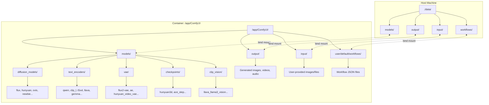

# ComfyUI Flux

Docker-based setup for [ComfyUI](https://github.com/comfyanonymous/ComfyUI) with selectable model packs for image, video, 3D, and audio generation.

## Features

- Dockerized ComfyUI and ComfyUI-Manager
- **7 fully functional model packs** with automatic downloads
- **Two controlling env vars**: `MODELS_DOWNLOAD` (comma-separated selectors) and `LOW_VRAM` (boolean)
- **LOW_VRAM=true**: Optimized for ~16GB VRAM (smaller/fp8 variants, conservative workflows)
- **LOW_VRAM=false**: Optimized for ~20GB VRAM (larger variants, higher throughput)
- Tutorial URLs printed at runtime for each selected pack
- Idempotent model/workflow downloads; actionable logs on failure
- **Automatic CUDA wheel selection** (supports CUDA 12.1, 12.4, 12.6, 13.0+)

## Prerequisites

- Docker and Docker Compose
- NVIDIA GPU with CUDA support (CUDA 12.1 or newer recommended)
- (Optional) `HF_TOKEN` for packs that require Hugging Face (e.g. klein-distilled)

## CUDA Auto-Detection

At container startup, the entrypoint automatically detects the host CUDA version and installs the appropriate PyTorch wheels:

| Host CUDA Version  | Wheel Tag | Notes                            |
| ------------------ | --------- | -------------------------------- |
| >= 13.0            | `cu130`   | Latest CUDA support              |
| >= 12.6            | `cu126`   | Recommended for most modern GPUs |
| >= 12.4            | `cu124`   | Broad compatibility              |
| >= 12.1            | `cu121`   | Minimum for GPU acceleration     |
| < 12.1 or no GPU   | `cpu`     | CPU-only (warning displayed)     |

The startup log shows the detected version and selected wheel:

```text
########################################
[INFO] CUDA/PyTorch Configuration
########################################
[INFO] Detected CUDA version: 12.6
[INFO] Selected wheel tag: cu126
[INFO] PyTorch already installed with matching CUDA (12.6)
[INFO] Skipping reinstallation
----------------------------------------
```

To override auto-detection, set `CUDA_WHEEL_TAG` in your environment:

```yaml
environment:
  - CUDA_WHEEL_TAG=cu124   # Force specific wheel version
```

## Quick Start

1. (Optional) Create a `.env` file:

   ```bash
   HF_TOKEN=your_huggingface_token   # required for klein-distilled
   LOW_VRAM=false                    # true for 16GB GPUs, false for 20GB+
   MODELS_DOWNLOAD=klein-distilled   # default; comma-separated for multiple
   ```

2. Example `docker-compose.yml` (env section):

   ```yaml
   environment:
     - CLI_ARGS=
     - HF_TOKEN=${HF_TOKEN}
     - LOW_VRAM=${LOW_VRAM:-false}
     - MODELS_DOWNLOAD=${MODELS_DOWNLOAD:-klein-distilled}
   ```

3. Run:

   ```bash
   docker-compose up -d
   ```

4. Open ComfyUI at `http://localhost:8188`

## Host Bind Mounts (Recommended)

For persistent storage of models, inputs, outputs, and workflows, mount specific directories from the host instead of relying on container-internal paths.

### Path Mapping

| Purpose   | Host Path (example) | Container Path                        | Notes                                                                                            |
| --------- | ------------------- | ------------------------------------- | ------------------------------------------------------------------------------------------------ |
| Models    | `./data/models`     | `/app/ComfyUI/models`                 | Downloaded models populate here (subdirs: `diffusion_models/`, `text_encoders/`, `vae/`, etc.)   |
| Input     | `./data/input`      | `/app/ComfyUI/input`                  | Place images/files here for ComfyUI to access                                                    |
| Output    | `./data/output`     | `/app/ComfyUI/output`                 | Generated images/videos/audio saved here                                                         |
| Workflows | `./data/workflows`  | `/app/ComfyUI/user/default/workflows` | JSON workflow files from pack downloads                                                          |

### Directory Structure



### docker-compose.yml with Bind Mounts

```yaml
services:
  comfyui:
    container_name: comfyui
    image: atticusg3/comfyui-flux2:latest
    restart: unless-stopped
    ports:
      - "8188:8188"
    volumes:
      - "./data/models:/app/ComfyUI/models"
      - "./data/input:/app/ComfyUI/input"
      - "./data/output:/app/ComfyUI/output"
      - "./data/workflows:/app/ComfyUI/user/default/workflows"
    environment:
      - CLI_ARGS=
      - HF_TOKEN=${HF_TOKEN}
      - LOW_VRAM=${LOW_VRAM:-false}
      - MODELS_DOWNLOAD=${MODELS_DOWNLOAD:-klein-distilled}
    deploy:
      resources:
        reservations:
          devices:
            - driver: nvidia
              device_ids: ['0']
              capabilities: [gpu]
```

### Important Notes

- **Pack downloads**: When using `MODELS_DOWNLOAD`, models and workflows are written directly to the mounted directories and persist on the host.
- **Generated outputs**: ComfyUI saves all generated content (images, videos, audio) to `/app/ComfyUI/output`. With the bind mount, these appear at `./data/output/` on the host.
- **Input files**: Place any images or files you want to use in ComfyUI at `./data/input/` on the host. They will be visible in ComfyUI's file browser.
- **No mount fallback**: If you don't mount any volumes, the container uses internal paths and works normally. Data will be lost when the container is removed.
- **User/permissions**: The container runs as the `runner` user (UID 1000). If you encounter permission issues on Linux, ensure host directories are accessible: `chmod -R 777 ./data` or `chown -R 1000:1000 ./data`.
- **Startup logging**: The entrypoint prints mount status at startup:

```text
########################################
[INFO] Directory Configuration
########################################
models dir:    /app/ComfyUI/models (mounted: yes)
input dir:     /app/ComfyUI/input (mounted: yes)
output dir:    /app/ComfyUI/output (mounted: yes)
workflows dir: /app/ComfyUI/user/default/workflows (mounted: yes)
----------------------------------------
```

## Environment Variables

| Variable          | Description                                                                                      |
| ----------------- | ------------------------------------------------------------------------------------------------ |
| `MODELS_DOWNLOAD` | Comma-separated list of pack selectors. Default: `klein-distilled`.                              |
| `LOW_VRAM`        | `true` = 16GB VRAM target (fp8/smaller models). `false` = 20GB target.                           |
| `HF_TOKEN`        | Hugging Face token; required for klein-distilled diffusion models.                               |
| `CLI_ARGS`        | Extra arguments passed to ComfyUI (e.g. VRAM presets below).                                     |
| `CUDA_WHEEL_TAG`  | (Optional) Override auto-detected CUDA wheel. Values: `cu130`, `cu126`, `cu124`, `cu121`, `cpu`. |

## Available Packs

All packs are fully functional with real model URLs and workflow downloads.

| Selector          | Type  | Description                                       | Tutorial                                                                                      | HF Token |
| ----------------- | ----- | ------------------------------------------------- | --------------------------------------------------------------------------------------------- | -------- |
| `klein-distilled` | Image | Flux.2 Klein distilled (4B/9B) - fastest Flux     | [docs.comfy.org](https://docs.comfy.org/tutorials/flux/flux-2-klein)                          | Required |
| `hunyuan-3d`      | 3D    | Hunyuan3D-2 - 3D model generation from images     | [docs.comfy.org](https://docs.comfy.org/tutorials/3d/hunyuan3D-2)                             | No       |
| `flux1-krea`      | Image | Flux.1 Krea Dev - unique aesthetic, natural       | [docs.comfy.org](https://docs.comfy.org/tutorials/flux/flux1-krea-dev)                        | No       |
| `hunyuan-video`   | Video | Hunyuan Video - 13B DiT for T2V and I2V           | [docs.comfy.org](https://docs.comfy.org/tutorials/video/hunyuan/hunyuan-video)                | No       |
| `ace-step`        | Audio | ACE-Step - music generation (T2A, A2A)            | [docs.comfy.org](https://docs.comfy.org/tutorials/audio/ace-step/ace-step-v1)                 | No       |
| `ovis-image`      | Image | Ovis-Image 7B - excellent text rendering          | [docs.comfy.org](https://docs.comfy.org/tutorials/image/ovis/ovis-image)                      | No       |
| `newbie-image`    | Image | NewBie-image - anime style with XML prompts       | [docs.comfy.org](https://docs.comfy.org/tutorials/image/newbie-image/newbie-image-exp-0-1)    | No       |

### Pack Aliases

Each pack supports multiple selector aliases:

| Primary           | Aliases                    |
| ----------------- | -------------------------- |
| `klein-distilled` | `flux2-klein`, `klein`     |
| `hunyuan-3d`      | `hunyuan3d`, `hunyuan3d-2` |
| `flux1-krea`      | `krea`, `flux-krea`        |
| `hunyuan-video`   | `hunyuanvideo`, `hyvideo`  |
| `ace-step`        | `acestep`, `ace`           |
| `ovis-image`      | `ovis`, `ovisimage`        |
| `newbie-image`    | `newbie`, `newbieimage`    |

## VRAM Requirements

| Pack            | 16GB Mode          | 20GB Mode          | Notes                   |
| --------------- | ------------------ | ------------------ | ----------------------- |
| klein-distilled | 4B model (~8.4GB)  | 9B model (~9.2GB)  | Fast inference ~1.2s    |
| hunyuan-3d      | Single-view (~6GB) | Full multiview     | Shape + texture ~12GB   |
| flux1-krea      | FP8 (~12GB)        | FP16 (~20GB)       | Natural aesthetic       |
| hunyuan-video   | T2V only (~16GB+)  | T2V + I2V          | Heavy - use --lowvram   |
| ace-step        | 3.5B (~6GB)        | 3.5B (~6GB)        | Lightweight audio       |
| ovis-image      | 7B with --lowvram  | 7B full speed      | Text rendering          |
| newbie-image    | 3.5B (~8GB)        | 3.5B (~8GB)        | Anime style             |

## What Gets Downloaded

### klein-distilled (default)

- **16GB**: 4B text encoder, VAE, flux-2-klein-4b-fp8
  - Workflows: text-to-image, image-edit
- **20GB**: 9B text encoder, VAE, flux-2-klein-9b-fp8
  - Workflows: text-to-image, image-edit

### hunyuan-3d

- **16GB**: Single-view model only (hunyuan3d-dit-v2)
  - Workflows: single-view-to-3d
- **20GB**: Multiview, turbo, and single-view models
  - Workflows: multiview, turbo, single-view

### flux1-krea

- **16GB**: FP8 diffusion model, T5-XXL FP8, CLIP-L, VAE
- **20GB**: FP8 diffusion model, T5-XXL FP16, CLIP-L, VAE

### hunyuan-video

- **16GB**: T2V model only (text encoders, VAE, diffusion model)
  - Workflows: text-to-video
- **20GB**: T2V + I2V models (adds CLIP vision, I2V diffusion model)
  - Workflows: text-to-video, image-to-video v1/v2

### ace-step

- **Both**: ACE-Step v1 3.5B checkpoint
  - Workflows: text-to-audio, audio-to-audio

### ovis-image

- **Both**: Ovis 2.5 text encoder, diffusion model, VAE
  - Workflows: text-to-image

### newbie-image

- **Both**: Gemma 3 4B, Jina CLIP v2, diffusion model, VAE
  - Workflows: text-to-image (supports XML structured prompts)

## ComfyUI CLI_ARGS Presets

ComfyUI supports `--lowvram`, `--highvram`, `--normalvram`, `--novram`, and `--reserve-vram <GB>`.

### 16GB GPU (LOW_VRAM=true)

```bash
CLI_ARGS="--lowvram --reserve-vram 1.2"
```

Optional: `--cpu-vae` to run VAE on CPU; `--use-split-cross-attention` if not using xformers.

### 20GB GPU (LOW_VRAM=false)

```bash
CLI_ARGS="--highvram"
```

Optional: `--normalvram` for default unloading behaviour.

## Example Setups

### 16GB GPU - Klein distilled only

```yaml
environment:
  - LOW_VRAM=true
  - MODELS_DOWNLOAD=klein-distilled
  - HF_TOKEN=${HF_TOKEN}
  - CLI_ARGS=--lowvram --reserve-vram 1.2
```

### 20GB GPU - Klein + Hunyuan3D

```yaml
environment:
  - LOW_VRAM=false
  - MODELS_DOWNLOAD=klein-distilled,hunyuan-3d
  - HF_TOKEN=${HF_TOKEN}
  - CLI_ARGS=--highvram
```

### 20GB GPU - Video generation

```yaml
environment:
  - LOW_VRAM=false
  - MODELS_DOWNLOAD=hunyuan-video
  - CLI_ARGS=--highvram
```

### 16GB GPU - Audio generation

```yaml
environment:
  - LOW_VRAM=true
  - MODELS_DOWNLOAD=ace-step
  - CLI_ARGS=--lowvram
```

### Multiple packs

```yaml
environment:
  - LOW_VRAM=false
  - MODELS_DOWNLOAD=klein-distilled,flux1-krea,ovis-image
  - HF_TOKEN=${HF_TOKEN}
  - CLI_ARGS=--highvram
```

## Runtime Output

When starting, the entrypoint first detects CUDA and configures PyTorch:

```text
########################################
[INFO] CUDA/PyTorch Configuration
########################################
[INFO] Detected CUDA version: 12.6
[INFO] Selected wheel tag: cu126
[INFO] PyTorch already installed with matching CUDA (12.6)
[INFO] Skipping reinstallation
----------------------------------------
```

Then it prints information for each selected pack:

```text
========================================
=== PACK: hunyuan-video ===
========================================
Tutorial: https://docs.comfy.org/tutorials/video/hunyuan/hunyuan-video
Target VRAM: 20GB (LOW_VRAM=false)
Models: 6 files
Workflows: 3 files
Custom nodes: 0
HF_TOKEN: not required
Notes: Full T2V and I2V workflows. Use --highvram for best performance.
----------------------------------------
```

If a required HF_TOKEN is missing, the script fails with a clear error and the tutorial URL.

## Updating

ComfyUI and ComfyUI-Manager are updated on container start. To update the image:

```bash
docker-compose pull
```

## Notes

- Downloads are idempotent (skip existing files where supported; workflows overwrite to refresh).
- On download failure the entrypoint logs an error and exits with a non-zero code.
- Changing `LOW_VRAM` or `MODELS_DOWNLOAD` and restarting will fetch the new selection.
- All workflows land in: `/app/ComfyUI/user/default/workflows/` (mount `./data/workflows` to persist on host).
- All models land in: `/app/ComfyUI/models/` subdirectories (mount `./data/models` to persist on host).
- Generated outputs go to: `/app/ComfyUI/output/` (mount `./data/output` to persist on host).
- See [Host Bind Mounts](#host-bind-mounts-recommended) for the recommended volume configuration.
- Tutorial URLs are anchored to official ComfyUI documentation at docs.comfy.org.

## Pack Structure

Each pack under `scripts/packs/<name>/` contains:

```text
pack.json           # Metadata, tutorial URLs, HF requirements
models-16gb.txt     # Model URLs for 16GB target (aria2c format)
models-20gb.txt     # Model URLs for 20GB target
workflows-16gb.txt  # Workflow URLs for 16GB target
workflows-20gb.txt  # Workflow URLs for 20GB target
nodes.txt           # (optional) Custom node git URLs
```

## License

See individual model licenses at their respective Hugging Face repositories.
